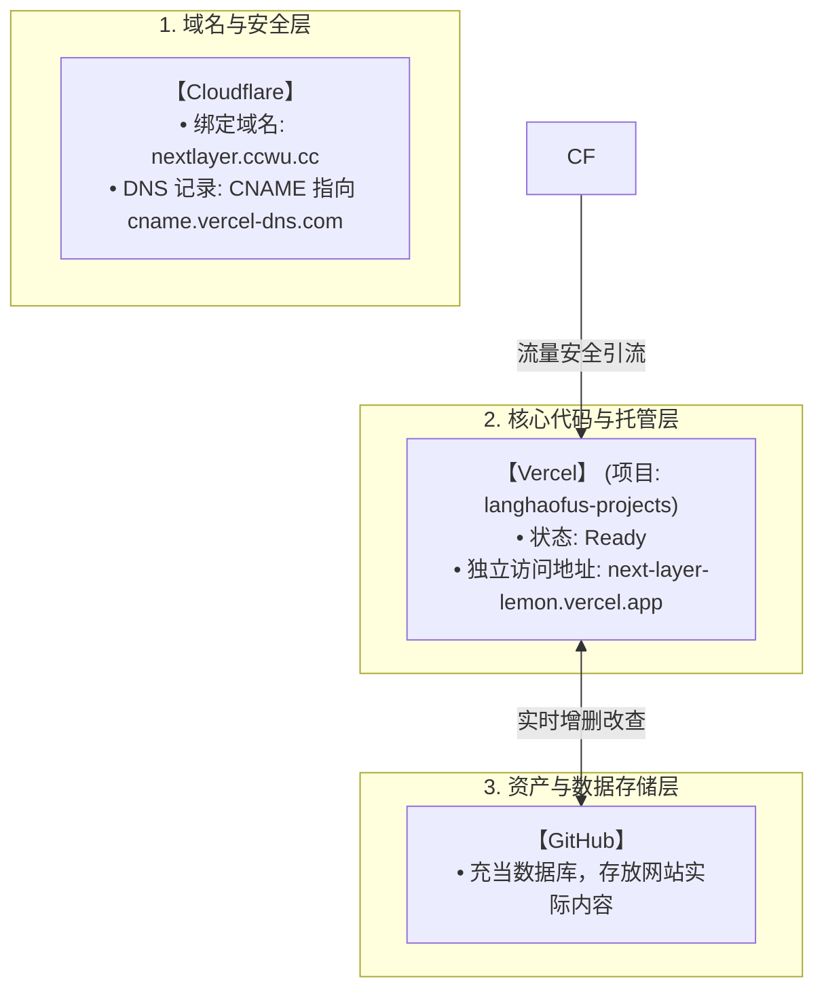

```mermaid
graph TD

    %% 第二部分：网站架构与流量走向
    subgraph Layer1 [1. 域名与安全层]
        C["【Cloudflare】<br>• 绑定域名: nextlayer.ccwu.cc<br>• DNS 记录: CNAME 指向 cname.vercel-dns.com"]
    end

    subgraph Layer2 [2. 核心代码与托管层]
        VC["【Vercel】 (项目: langhaofus-projects)<br>• 状态: Ready<br>• 独立访问地址: next-layer-lemon.vercel.app"]
    end

    subgraph Layer3 [3. 资产与数据存储层]
        GH["【GitHub】<br>• 充当数据库，存放网站实际内容"]
    end

    %% 架构层级之间的流量线
    CF -->|流量安全引流| VC
    VC <-->|实时增删改查| GH
```